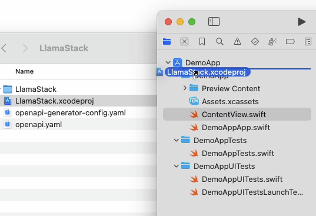
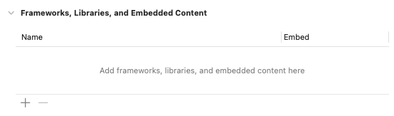
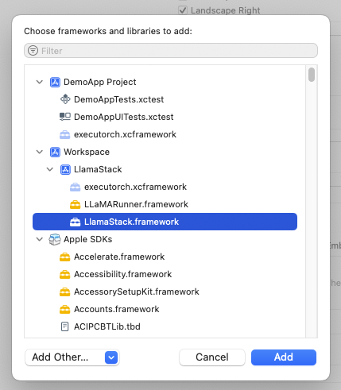

# llama-stack-client-swift

[](https://discord.gg/TZAAYNVtrU)

llama-stack-client-swift brings the inference and agents APIs of [Llama Stack](https://github.com/meta-llama/llama-stack) to iOS.

## Features

- **Local Inference & Agents:** Run Llama completely on-device via [executorch](https://github.com/pytorch/executorch).
- **Remote Inference & Agents:** Leverage a remote Llama Stack distribution for larger models, code execution, and safety.
- **Custom Tool Calling:**  Provide Swift tools that Llama agents can understand and use.

## Installation

1. Clone this repository

2. Drag `LlamaStack/LlamaStack.xcworkspace` into your app



3. In the app's targets, add a framework:



4. Select and add the LlamaStack framework



5. Test out a call to a remote Llama Stack:

```swift
import LlamaStack
let inference = RemoteInferenceService(url: URL(string: "http://127.0.0.1:5000")!)
    for await chunk in try await inference.chatCompletion(
        request:
            Components.Schemas.ChatCompletionRequest(
            messages: [
                .UserMessage(Components.Schemas.UserMessage(
                    content: .case1("Hello Llama!"),
                    role: .user)
                )
            ], model: "Meta-Llama3.1-8B-Instruct",
            stream: true)
        ) {
        switch (chunk.event.delta) {
        case .case1(let s):
            print(s)
        case .ToolCallDelta(_):
            break
        }
    }
```

6. See below section if you want to set up local inference

## Installation: Local Inference

1. Prepare a [.pte](https://pytorch.org/executorch/stable/pte-file-format.html) and tokenizer file for your model [following these instructions](https://github.com/pytorch/executorch/blob/main/examples/models/llama2/README.md#step-2-prepare-model).
2. Bundle these files into your main app Bundle
